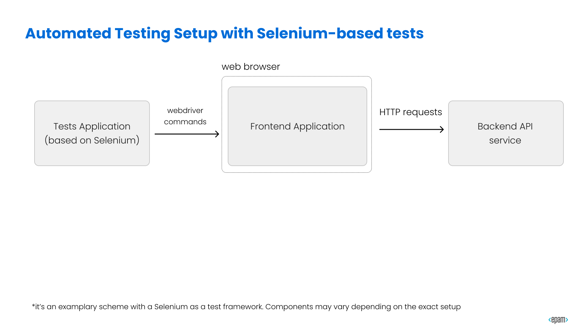
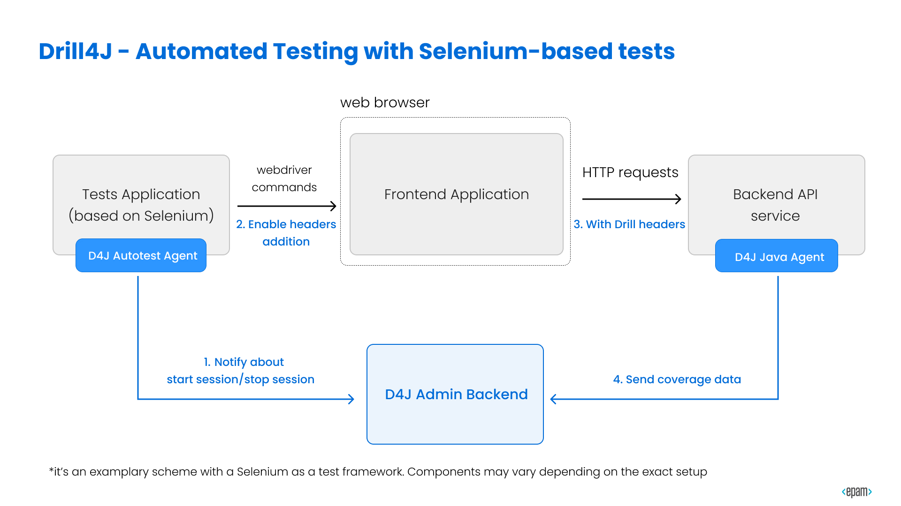
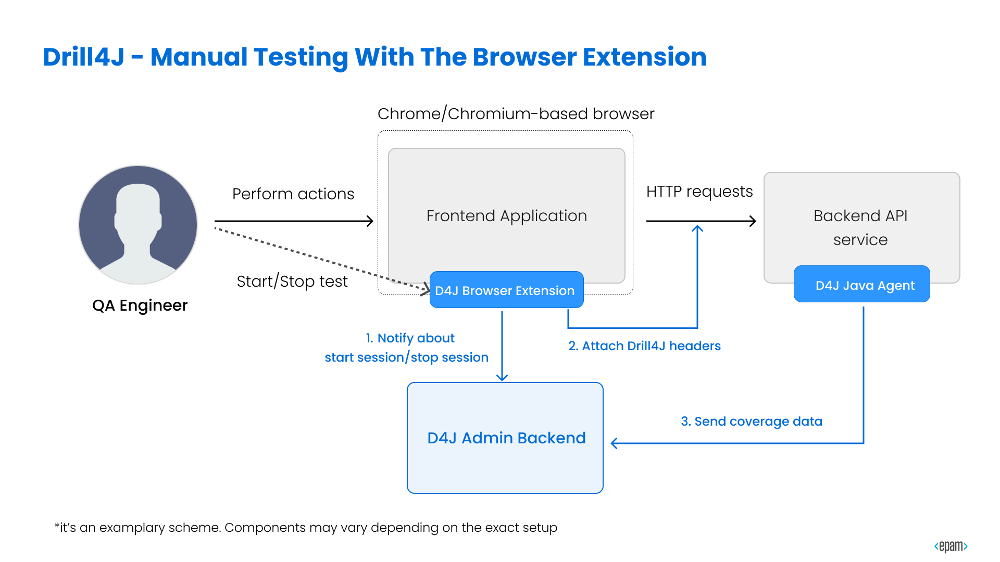
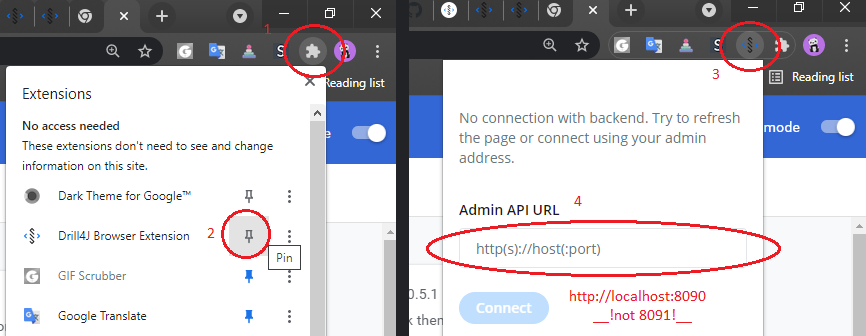

# ZED Conference 2021 - Drill4J Workshop

This repository is created to enable anyone to learn installation process of Drill4J based on the example Petclinic project.

It's was created as a part of Drill4J Workshop for ZED Conference 2021. You should probably find a video, and watch it if you can.

> It might look long and intimidating, but in reality, it's just very thorough. You can do it!

To follow the instructions, first make sure that all prerequisites are met:

## Prerequisites

Installed applications:

1. Java 8
2. Git
3. Docker Desktop
4. [IntelliJ IDEA](https://www.jetbrains.com/idea/) (a free Community Edition will do)

> Docker Desktop is a requirement for __this particular workshop__.
>
> but __it is not__ a hard requirement for using Drill4J.
>
> You can refer to our [Documentation](https://drill4j.github.io/docs/installation/drill-admin) for alternative installation options.

## Preparation

### Example project

1. Clone the example Petclinic project <https://github.com/Drill4J/spring-petclinic>

2. __IMPORTANT:__ Checkout __the `zed` branch__

3. Take a look at the project sources and Dockerfile

### Example tests

1. Clone project with automated tests <https://github.com/Drill4J/petclinic-autotests>

2. __IMPORTANT:__ Checkout __the `zed` branch__ as well

3. Open with IntelliJ IDEA and wait for dependencies to install

### Drill4J Services

1. Clone this project

2. Open terminal of your choice, navigate to the  [./drill4j-services folder](./drill4j-services).

3. Start the required services with `docker-compose up -d`

4. Wait just a bit

5. Navigate to Drill4J Admin Panel at <http://localhost:8091>. You should see an empty page

> OPTIONAL TIP: in case you are going through this workshop _a second time_, and you see some agents already
>
> to get rid of all agents:
>
> 1. you can stop all running docker containers with `docker-compose down`
(__WARNING__ be mindful, do not use __the next command__ if you have other data stored in docker volumes)
> 2. and then clear volumes with `docker volume prune` and enter `y` when prompted to

## How it works (briefly)

Imagine a basic picture of your average Selenium tests (simplified for the explanation purposes)



And now, this is how it looks with Drill4J installed and configured.



You can see 3 key integration points:

1. The target application. The [__Drill4J Java Agent__](https://github.com/Drill4J/java-agent) is added to the target app to enable metrics collection.

2. The [__Drill4J Autotesting Agent__](https://github.com/Drill4J/js-auto-test-agent) - __it relays tests metadata__ to Drill4J Backend Service, __integrates__ with various testing frameworks and __configures__ Selenium to add headers to the  HTTP requests

3. The [__Drill4J Backend__](https://github.com/Drill4J/admin) processes data and provides results via API.

The manual setup does not look much different: instead of Autotesting Agent, there is a [__Drill4J Browser Extension__](https://github.com/Drill4J/browser-extension/releases), that one have to use, to capture the testing metrics.



## The integration process

To enable Drill4J metrics for Petclinic tests, we have to do just that:

1. Add Drill4J Java Agent to Petclinic application

2. Add Drill4J Auto Testing Agent to tests application __via Gradle plugin__.

    > you can check [docs](https://drill4j.github.io/docs/installation/autotest-agent) for other options

3. Deploy DrillJ services. (_we did that already_)

### Add Drill4J Java Agent

1. Open [docker-compose.yml](https://github.com/Drill4J/spring-petclinic/blob/zed/docker-compose.yml) in Petclinic project.

2. Using our docs [Using Docker Images](https://drill4j.github.io/docs/installation/java-agent#using-docker-images) add the following services (change placeholder values accordingly)

```yml
services:
  petclinic:
    image: drill4j/spring-petclinic-sample:0.1.0-zed
    ports:
      - 8080:8080
    volumes:
      - agent-files:/data/agent
    environment:
      - JAVA_TOOL_OPTIONS="-agentpath:/data/agent/libdrill_agent.so=drillInstallationDir=/data/agent,adminAddress=host.docker.internal:8090,agentId=petclinic-project,buildVersion=0.1.0,logLevel=DEBUG"

  agent-files:
    image: drill4j/java-agent:0.8.0-19
    volumes:
      - agent-files:/data/agent
```
> We have created 3 exemplary Petclinic builds beforehand, just for the workshop sake, to save you time on making builds

3. __And add the volume__ at the end of the file (it's mandatory to allow app to access agent files)

```yml
volumes:
  agent-files:
```

Pay attention to:

1. `adminAddress=` value (it poits to Drill4J Admin Backend API)
2. `agentId=` - it's our project identifier within Drill4J
3. `buildVersion=` - this value __must be updated__ each time new version is deployed (typically, it's automated with CI/CD and env variables)
4. `/data/agent` - path to Drill4J agent files. Must be the same in all volumes and `JAVA_TOOL_OPTIONS` (4 entries total)
Agent files are loaded by `drill4j/java-agent` container.

> TIP_1: [complete file example](./example/docker-compose.yml)

> TIP_2: you __can__ supply __Drill4J Agent Files__ however you like (e.g. download manually), just make sure to pass adequate params to `JAVA_TOOL_OPTIONS` to target application

### Add Drill4J Auto Testing Agent to tests application __via Gradle plugin__

For this workshop, [`build.gradle`](https://github.com/Drill4J/petclinic-autotests/blob/zed/build.gradle) is preconfigured with Drill4J Autotesting Agent plugin already.

Open `build.gradle` file and take a look. Find all entries of Drill4J word, an you can figure it out for yourself.
Refer to [docs](https://drill4j.github.io/docs/installation/autotest-agent/#gradle) for additional info on plugin configuration.

> TIP: You can check [docs](https://drill4j.github.io/docs/installation/autotest-agent) for other options
>
> TIP: Remote setup: <https://drill4j.github.io/docs/installation/autotest-agent#notes>

## Using Drill4J

1. Navigate to Petclinic project folder and __deploy the application build 0.1.0__ by running

    ```shell
    docker-compose up -d
    ```

2. Navigate to auto tests project folder and start autotests with

    ```shell
    gradle clean :testng:test -Pstandalone -DpetclinicUrl=<http://localhost:8080> -DisRemote=false -DagentId=petclinic-project
    ```

3. Wait for the tests to complete

4. Open Drill4J Admin UI Panel at <http://localhost:8091> and navigate to the [build 0.1.0 Petclinic agent's page](http://localhost:8091/full-page/petclinic-project/0.1.0/test2code/dashboard/methods)

5. __IMPORTANT__: click "Finish Scope" Button

    > Great! Now you can see the actual coverage collected by various tests.
    >
    > Use "Build methods" and "Build tests" tabs, to see coverage mapping from tests to code and visa versa.

6. __Stop the application build 0.1.0__: in Petclinic project folder, run:

    ```shell
    docker-compose stop petclinic
    docker-compose rm petclinic
    ```

7. In docker-compose.yml __change__ the petclinic build version from __0.1.0__ to __0.2.0__ in __both__ `JAVA_TOOL_OPTS` and `petclinic: image:` field

8. __Deploy the application build 0.2.0__

9. Get back to Open Drill4J Admin UI Panel at <http://localhost:8091>, and click the notification bell in the top-right corner. Then press "Go To Dashboard" button

    > Now! You can see the __Risks__ (either new or changed methods) that Drill4J has detected, and see which tests you should launch in order to cover these (test2runs).

10. Go to [0.2.0 build page](http://localhost:8091/full-page/petclinic-project/0.2.0/test2code/dashboard/methods) for more info

11. Click "Risks" in the top right corner to see the changed methods.

12. Click "Tests2Run" next to it, to open page with suggested tests.

13. Use "Get Suggested Tests" button to obtain CURL command, that returns JSON with list of the suggested tests.

> Obvious tip: you can utilize this data in your CI/CD pipeline, to feed test automation framework, to launch only __the required__ tests

## Bonus feature - using Manual Browser Extension

0. Follow the [Installation guide](https://drill4j.github.io/docs/installation/extension)

1. Find Drill4J extension in extension pane icon in the top-right corner of the screen

2. Pin it

3. Click the extension icon

4. Enter Drill4J Backend API address (default in this workshop is `http://localhost:8090`)

    

5. Click the "Connect" button and wait for extension to establish connection.

    > If you have made a mistake and entered a completely wrong URL, you have to re-install extension (it's a known issue). Just navigate to <chrome://extensions/> and press "Remove", then install it again.

6. Navigate to Petclinic project page, click the extension icon again and press "Open widget"

7. Widget should appear on the page. Enter test name and press "Start Test" button. Press "Finish Test" button when you are done with our test.

8. Navigate to Drill4J Admin Panel to see the test coverage. You can find your specific test in under "Build Tests" tab. Use test name to filter the table.
